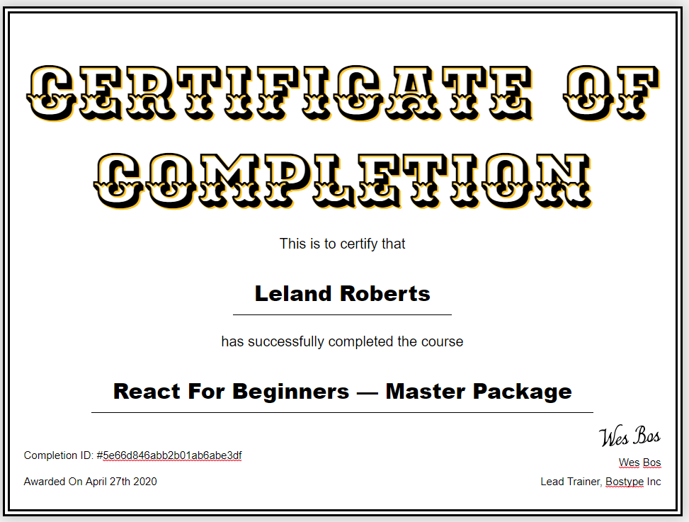

# Seafood Menu

So I've completed the Wes Bos: ReactJS for Beginners course! I got extra practice on the skills I've gained from my General Assembly SEI course and learned even more from Wes Bos course. 

# Main Takeaways

I gained experience working with Google's Firebase service to setup a real-time database. Firebase uses web sockets  to communicate real-time with the database for requested data changes.

I implemented authentication into the application so only the owner of the store can edit the contents on the menu.

Integrated social media login with Github, Facebook, and Twitter. (SIDENOTE: login with Github to get edit inventory priveleges)

Learned how to add animation to react components. 

Learned to persist data in localstorage so the data won't be lost if webpage reloads. 

# View the web application here:
<a href="https://practical-raman-9aaaa7.netlify.app/">Click Here to use app!</a>

# Course Certificate:
